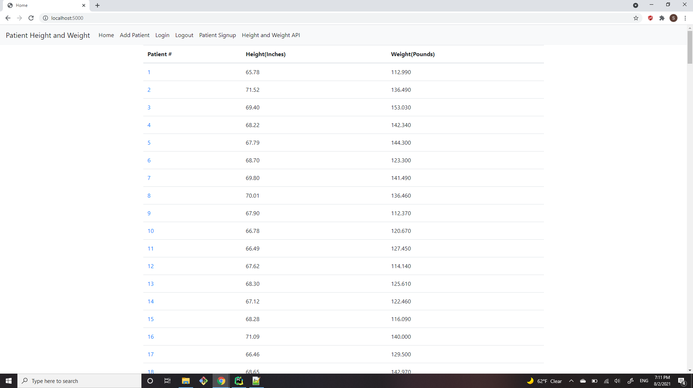
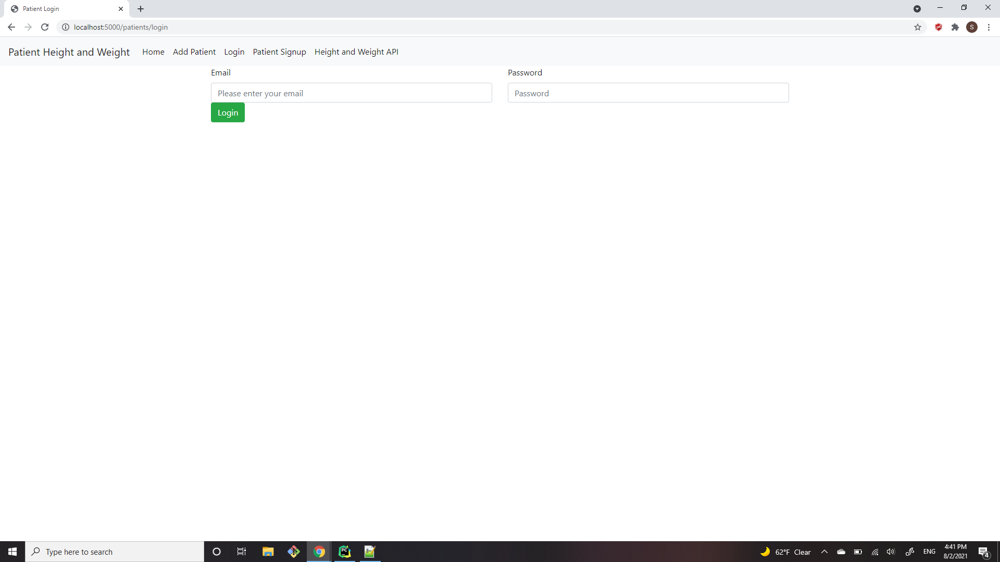

#Project Description
This project is a homework assignment to teach how to get Pycharm setup with Docker, Flask, Flask Login, MySQL, and Postman

To run this project after running the docker compose a user must signup and login before being able to add, edit, or delete a patient.
If a user tries to add, edit, or delete a patient before signing up and logging in the user will be redirected to the login page.

#Homepage Screenshot

#Login Page Screenshot

#Signup Page Screenshot

Author: Spencer Escalante
